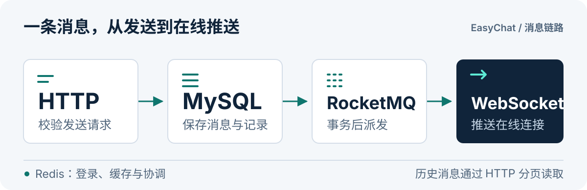

# EasyChat

基于 **Spring Boot、Netty 与 RocketMQ** 的 Java 即时通信后端，覆盖微信扫码登录、单聊、群聊与多类型消息。

[功能](#功能) · [本地运行](#本地运行) · [客户端接入](#客户端接入) · [代码地图](#代码地图) · [当前边界](#当前边界)

仓库提供服务端源码、基础组件和 MySQL 初始化脚本。客户端与运行环境需另行准备。

<p align="center">
  
</p>

**发送走 HTTP，实时通知走 WebSocket。** 消息先校验并落库，事务提交后发送到消息队列；消费者更新房间和会话信息，再将通知推送到在线连接。历史消息由分页接口读取。

## 功能

| 领域 | 已有能力 |
| --- | --- |
| 登录与在线状态 | 微信公众号扫码登录、JWT 登录态与 Token 校验、WebSocket 心跳与上下线通知 |
| 聊天消息 | 单聊与群聊；文本、图片、文件、语音、视频、表情、系统消息；文本回复与 @ 提醒 |
| 消息交互 | 历史消息游标分页、撤回、消息标记、阅读上报、已读/未读列表与数量统计 |
| 好友与会话 | 好友申请、同意申请、删除好友、联系人列表、会话列表与会话详情 |
| 群组管理 | 创建群组、邀请/移除成员、退出群聊、设置/撤销管理员、成员列表 |
| 用户与媒体 | 用户资料、修改昵称、徽章、个人表情包、管理员拉黑、MinIO 上传预签名链接 |
| 基础组件 | Redis 缓存与分布式锁、接口频控、敏感词处理、本地调用记录与失败重试 |
| AI 扩展 | ChatGPT / ChatGLM2 适配代码，默认关闭；通过热门群聊中的 @ 机器人触发 |

能力范围以 [Controller](./easychat-chat-server/src/main/java/com/muzi/easychat/chat/controller/)、[消息策略](./easychat-chat-server/src/main/java/com/muzi/easychat/chat/service/strategy/msg/) 和 [用户模块](./easychat-chat-server/src/main/java/com/muzi/easychat/user/) 为准。

## 本地运行

### 1. 获取源码与准备依赖

```sh
git clone https://github.com/MuziGeek/easy-chat.git
cd easy-chat
```

| 依赖 | 用途与准备事项 |
| --- | --- |
| JDK / Maven | POM 的编译目标为 Java 8，建议使用 JDK 8 与 Maven 3.x |
| MySQL | 消息、用户、群组、会话和本地调用记录；仓库使用 MySQL 8.0.29 驱动 |
| Redis | 登录态、缓存、计数与 Redisson 锁；当前配置使用单节点连接 |
| RocketMQ | 聊天消息分发、WebSocket 广播与扫码登录事件；需要 NameServer 和 Broker |
| MinIO | 媒体文件直传；预先创建存储桶，并配置客户端所需的文件访问方式 |
| 微信公众号 | 当前登录链路依赖公众号二维码、事件回调与网页授权，需要相应接口权限 |

Redis、RocketMQ 与 MinIO 的服务端版本未在仓库中锁定，需结合自己的运行环境确认。

### 2. 初始化开发数据库

在 MySQL 客户端中创建一个新的开发库，然后导入 [doc/easychat.sql](./doc/easychat.sql)：

```sql
CREATE DATABASE easychat CHARACTER SET utf8mb4 COLLATE utf8mb4_unicode_ci;
USE easychat;
SOURCE /absolute/path/to/easy-chat/doc/easychat.sql;
```

将路径替换为本机位置；Windows 路径可写成 `D:/path/to/easy-chat/doc/easychat.sql`。脚本包含 `DROP TABLE`，应导入新建开发库，避免覆盖已有记录。

### 3. 创建本地配置

在仓库根目录创建 `application-local.yml`，按自己的环境调整下列模板。现有 `.gitignore` 忽略 `*.yml`；配置中的环境变量需在启动前设置。

```yaml
server:
  port: 8080

spring:
  application:
    name: easychat
  mvc:
    pathmatch:
      matching-strategy: ant_path_matcher
  datasource:
    driver-class-name: com.mysql.cj.jdbc.Driver
    url: jdbc:mysql://127.0.0.1:3306/easychat?useUnicode=true&characterEncoding=UTF-8&serverTimezone=Asia/Shanghai
    username: ${EASYCHAT_DB_USERNAME}
    password: ${EASYCHAT_DB_PASSWORD}
  redis:
    host: 127.0.0.1
    port: 6379
    database: 0
    password: ${EASYCHAT_REDIS_PASSWORD}

rocketmq:
  name-server: 127.0.0.1:9876
  producer:
    group: easychat-producer

easychat:
  jwt:
    secret: ${EASYCHAT_JWT_SECRET}

oss:
  enabled: true
  type: minio
  endpoint: http://127.0.0.1:9000
  access-key: ${EASYCHAT_OSS_ACCESS_KEY}
  secret-key: ${EASYCHAT_OSS_SECRET_KEY}
  bucket-name: easychat

wx:
  mp:
    callback: ${EASYCHAT_WX_BASE_URL}
    configs:
      - app-id: ${EASYCHAT_WX_APP_ID}
        secret: ${EASYCHAT_WX_SECRET}
        token: ${EASYCHAT_WX_TOKEN}
        aes-key: ${EASYCHAT_WX_AES_KEY}
```

微信接入需区分两个地址：

- **公众号事件接收地址：** `https://你的域名/wx/portal/public`。
- **网页授权回调：** `wx.mp.callback` 填基础地址，例如 `https://你的域名`，不要带结尾 `/` 或回调路径；代码会拼接 `/wx/portal/public/callBack`。在公众号后台配置相应域名，并确保微信能够访问服务。

当前 Spring Bean 装配需要微信配置和 MinIO 组件；上面的模板使用环境变量引用，不包含可直接使用的凭证。配置字段可对照 [WxMpProperties](./easychat-chat-server/src/main/java/com/muzi/easychat/common/config/WxMpProperties.java) 与 [OssProperties](./easychat-framework/easychat-oss-starter/src/main/java/com/muzi/easychat/oss/OssProperties.java)。

<details>
<summary>RocketMQ 主题与 AI 配置</summary>

Broker 需要允许创建下列主题，或提前创建它们：

| 主题 | 用途 |
| --- | --- |
| `chat_send_msg` | 消息发送后更新房间、会话并派发通知 |
| `websocket_push` | 将推送广播到各服务实例的在线连接 |
| `user_login_send_msg` | 扫码授权后的登录结果 |
| `user_scan_send_msg` | 扫码成功、等待授权的通知 |

AI 默认关闭。开启前需准备机器人用户、服务地址及对应参数，参照 [ChatGPTProperties](./easychat-chat-server/src/main/java/com/muzi/easychat/chatai/properties/ChatGPTProperties.java)、[ChatGLM2Properties](./easychat-chat-server/src/main/java/com/muzi/easychat/chatai/properties/ChatGLM2Properties.java) 和 [AI Handler](./easychat-chat-server/src/main/java/com/muzi/easychat/chatai/handler/)。

</details>

### 4. 构建与启动

在仓库根目录执行：

```sh
mvn -pl easychat-chat-server -am clean package -DskipTests
java -jar easychat-chat-server/target/easychat-chat-server-1.0-SNAPSHOT.jar --spring.config.additional-location=file:./application-local.yml
```

构建与启动需要本地 JDK、Maven 和上述服务配置。POM 当前默认 `skipTests=true`，打包成功不代表登录、消息投递或群权限已完成运行验收。

按示例配置启动后，接入地址为：

| 入口 | 地址 |
| --- | --- |
| HTTP API | `http://localhost:8080/capi/...`，端口由 `server.port` 决定 |
| Knife4j 接口文档 | `http://localhost:8080/doc.html` |
| WebSocket | `ws://localhost:8090/`，当前端口在 [NettyWebSocketServer](./easychat-chat-server/src/main/java/com/muzi/easychat/websocket/NettyWebSocketServer.java) 中固定为 `8090` |

## 客户端接入

### 登录与保活

1. 建立 `ws://localhost:8090/` 连接，发送 `{"type":1}` 请求登录二维码。
2. 客户端展示返回的二维码；用户使用微信扫码并完成需要的授权。
3. 收到登录成功通知（`type=3`）后保存 Token，HTTP 请求携带 `Authorization: Bearer <TOKEN>`。
4. 已有 Token 的客户端通过 `ws://localhost:8090/?token=<TOKEN>` 建立认证连接。
5. 定期发送 `{"type":2}` 心跳，例如每 15 秒一次。服务端在 30 秒读空闲后断开连接，客户端需处理重连与 Token 失效。

请求帧使用 `type` 和可选的 `data`；响应帧使用 `type` 与 `data`。当前 Handler 处理二维码请求和心跳，连接认证通过 URL 中的 Token 完成。

<details>
<summary>服务端 WebSocket 通知类型</summary>

| type | 通知 |
| --- | --- |
| `1` / `2` / `3` | 登录二维码 / 扫码成功 / 登录成功 |
| `4` | 新消息 |
| `5` / `6` | 上下线通知 / Token 失效 |
| `7` / `8` / `9` | 拉黑 / 消息标记 / 消息撤回 |
| `10` / `11` | 好友申请 / 群成员变动 |

完整消息结构见 [WSRespTypeEnum](./easychat-chat-server/src/main/java/com/muzi/easychat/user/domain/enums/WSRespTypeEnum.java) 与 [响应对象](./easychat-chat-server/src/main/java/com/muzi/easychat/user/domain/vo/response/ws/)。

</details>

### 发送第一条文本消息

在已登录且已获得可访问房间 ID 后，向 HTTP API 发送请求：

```http
POST /capi/chat/msg
Authorization: Bearer <TOKEN>
Content-Type: application/json

{
  "roomId": 123,
  "msgType": 1,
  "body": {
    "content": "你好，EasyChat！"
  }
}
```

将 `roomId` 替换为真实房间 ID。文本内容最长 1024 个字符，可选传入 `replyMsgId` 和 `atUidList`；单条消息最多 @ 10 人。其他消息的请求体随 `msgType` 变化，参照 [消息类型](./easychat-chat-server/src/main/java/com/muzi/easychat/chat/domain/enums/MessageTypeEnum.java) 和 [消息策略](./easychat-chat-server/src/main/java/com/muzi/easychat/chat/service/strategy/msg/)。

### 常用接口

| 操作 | 接口 |
| --- | --- |
| 会话与历史 | `GET /capi/chat/public/contact/page` · `GET /capi/chat/public/msg/page` |
| 发送与撤回 | `POST /capi/chat/msg` · `PUT /capi/chat/msg/recall` |
| 阅读上报与统计 | `PUT /capi/chat/msg/read` · `GET /capi/chat/msg/read` |
| 好友申请与同意 | `POST /capi/user/friend/apply` · `PUT /capi/user/friend/apply` |
| 创建群与邀请成员 | `POST /capi/room/group` · `POST /capi/room/group/member` |
| 获取文件上传链接 | `GET /capi/oss/upload/url` |
| 个人表情包 | `/capi/user/emoji` 下的列表、新增与删除接口 |

完整参数、校验规则与返回结构以运行后的接口文档和 [Controller 源码](./easychat-chat-server/src/main/java/com/muzi/easychat/) 为准。

## 代码地图

```text
easy-chat/
├── easychat-chat-server/       # Spring Boot 服务端入口
│   └── src/main/
│       ├── java/com/muzi/easychat/
│       │   ├── chat/           # 消息、房间、群成员、会话与消息策略
│       │   ├── user/           # 用户、好友、扫码登录、表情与推送
│       │   ├── websocket/      # Netty 连接、握手、心跳与帧处理
│       │   ├── chatai/         # AI 消息处理适配
│       │   └── common/         # 配置、事件、拦截器、缓存与工具
│       └── resources/mapper/   # MyBatis XML
├── easychat-framework/
│   ├── easychat-common-starter/    # 公共依赖与基础工具
│   ├── easychat-transaction/       # 本地调用记录、事务后执行与重试
│   ├── easychat-oss-starter/       # MinIO 客户端与上传链接
│   ├── easychat-frequency-control/ # 独立频控实现
│   └── easychat-redis/             # Redis 模块占位（当前仅 POM）
└── doc/easychat.sql            # 表结构与初始化数据
```

消息链路对应 [ChatServiceImpl](./easychat-chat-server/src/main/java/com/muzi/easychat/chat/service/impl/ChatServiceImpl.java) → [MessageSendListener](./easychat-chat-server/src/main/java/com/muzi/easychat/common/event/listener/MessageSendListener.java) → [MsgSendConsumer](./easychat-chat-server/src/main/java/com/muzi/easychat/chat/consumer/MsgSendConsumer.java) → [PushConsumer](./easychat-chat-server/src/main/java/com/muzi/easychat/user/consumer/PushConsumer.java)。Redis 为登录、缓存和协调提供支持；MinIO 负责媒体对象存储。

## 当前边界

- 当前版本标识为 `1.0-SNAPSHOT`。仓库未附客户端、已验证的部署组合或性能压测结果。
- 现有测试源码只有 `contextLoads` 上下文测试。消息重连补偿、重复投递、群权限和异常流程仍需结合实际环境做集成验证。
- AI 适配属于可选扩展，默认关闭；外部接口、模型和机器人用户需自行配置并验证。
- 仓库暂未包含独立的 `LICENSE` 文件，授权范围尚未在仓库中声明。

欢迎通过 [Issue](https://github.com/MuziGeek/easy-chat/issues) 说明使用场景与复现步骤，或提交范围清楚、带有验证说明的改进。
